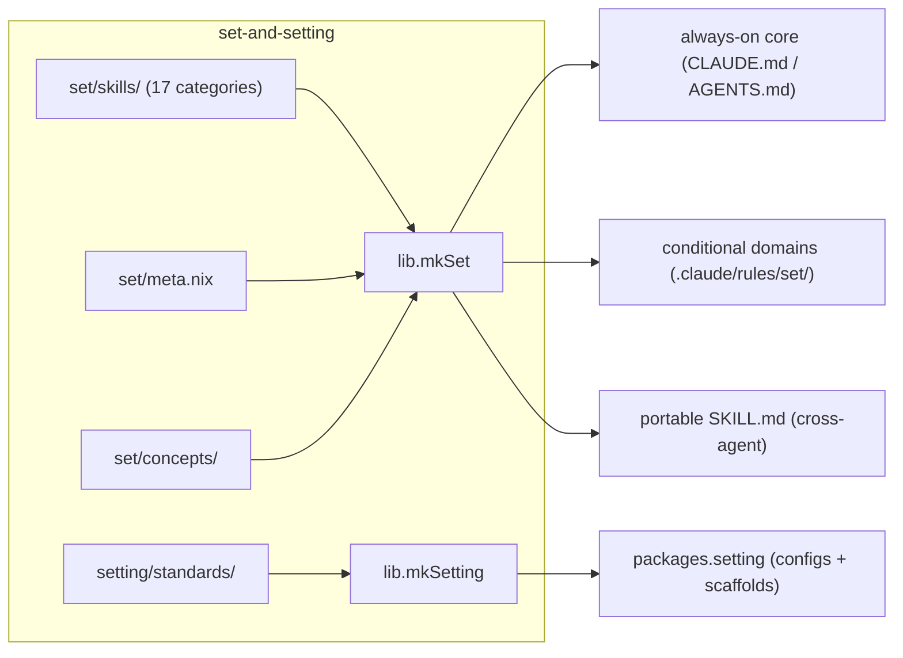
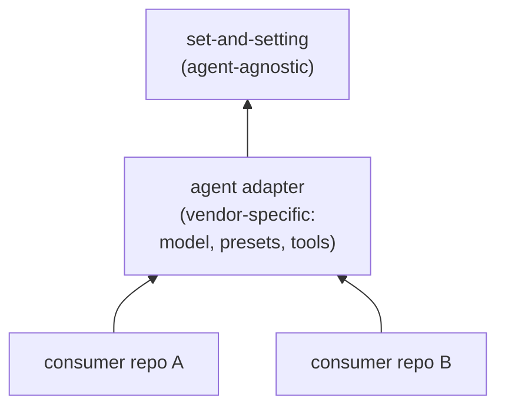
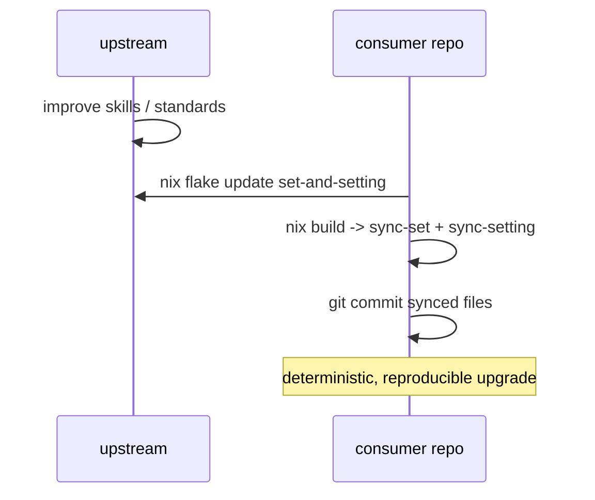

# set-and-setting

[](https://github.com/pr0d1r2/set-and-setting/actions/workflows/ci.yml)
[](https://nixos.org)

Deterministic, agent-agnostic **set** (mindset: skills, principles,
concepts) and **setting** (environment: guardrails, standards,
infrastructure) for AI coding agent trips.

Psychedelic metaphor: **set + setting = trip**.

## Get started -- one command, zero deps

```bash
nix run github:pr0d1r2/set-and-setting#mkSet
```

That is it. One command materializes curated AI coding skills into
`.claude/rules/set/` in your current directory. The only prerequisite
is nix with flakes enabled. Skills load through three channels
(always-on core, conditional domains, portable `SKILL.md`) so each
agent gets the right content at the right time.

Core categories (`generic` + `git`) install by default. Add more:

```bash
nix run github:pr0d1r2/set-and-setting#mkSet -- nix security opensource
```

Install everything:

```bash
nix run github:pr0d1r2/set-and-setting#mkSet -- --all
```

Smart mode detects your repo's file types and installs only relevant
skills:

```bash
nix run github:pr0d1r2/set-and-setting#mkSet -- --auto
```

Want unified configs (`.markdownlint.yml`, `.yamllint.yml`) and repo
scaffolds (`.editorconfig`, `.gitattributes`, `.gitignore`) too?
Bootstrap sets up skills and standards in one shot:

```bash
nix run github:pr0d1r2/set-and-setting#bootstrap
```

Run with `--help`, `--list`, or `--dry-run` on any installer to see
what it does before writing files.

Re-running `mkSet` with no arguments refreshes whatever was previously
installed (tracked in `.claude/rules/set/.mkset.json`). When upstream
changes, the installer detects the update and shows a notice.

## Multi-channel load model

Skills load through three channels per agent, each with a distinct
purpose and loading mechanism:

| Channel | What loads | When | Claude mechanism | Other agents |
| ------- | ---------- | ---- | ---------------- | ------------ |
| Always-on core | Universal skills (`generic`, `git`) | Every turn | `CLAUDE.md` `@`-manifest | Compiled `AGENTS.md` (inline) |
| Conditional domains | Domain skills (nix, security, ...) | On matching file | `.claude/rules/` path-scoped rules | Agent-specific rules dir |
| Portable `SKILL.md` | All skills (cross-agent) | Model-invoked | Deduped via `disable-model-invocation` | Root `SKILL.md` |

The always-on channel keeps initial context minimal (only universal
content). Domains load only when relevant -- on Claude, a `paths:`
frontmatter glob triggers loading when a matching file is read. The
portable `SKILL.md` provides cross-agent reach and `/`-invocability.

A sidecar meta map (`set/meta.nix`) declares each skill's channel,
path globs, and keywords -- the source markdown stays agent-agnostic.

### Smart materialization

With `--auto`, mkSet installs only skills
whose meta signals match the repo: `paths` globs match tracked file
types and `content` grep confirms the feature is actually used.
Facets that match force-pull their topic core. The manifest
(`.mkset.json`) records per-skill evidence for audit and smart
re-eval. `--all`, explicit categories, `--pin`, and `--exclude`
override.

## Three delivery paths

All three paths share one emitter -- the same skill sources produce
identical output regardless of how you consume them.

### Path 1 -- nix run (zero-dependency, per-CWD)

Run from any directory. Nix is the only dependency.

```bash
nix run github:pr0d1r2/set-and-setting#mkSet -- --all
nix run github:pr0d1r2/set-and-setting#mkSetting
nix run github:pr0d1r2/set-and-setting#mkSetting-init
nix run github:pr0d1r2/set-and-setting#mkScaffold
```

| App | What it does |
| --- | ------------ |
| `mkSet` | Materialize skills into `.claude/rules/set/` (3-channel layout) |
| `mkSetting` | Materialize unified configs (always overwrites) |
| `mkSetting-init` | Scaffold repo starters (skips files that exist) |
| `mkScaffold` | Scaffold flake.nix, lefthook.yml, CI workflow (skips files that exist) |
| `bootstrap` | All four in one command |

Skills are emitted at run time -- the installer carries agnostic
source and emitter scripts, not a pre-built per-agent tree. The
`--agent` flag selects a target agent (default: Claude); all 8
supported agents share the same emitter.

### Path 2 -- flake input (pinned, drift-checked)

Pin the version in your flake and sync after each update.

```nix
{
  inputs.set-and-setting.url = "github:pr0d1r2/set-and-setting";

  outputs = { self, nixpkgs, set-and-setting, ... }:
    let forAllSystems = ...; in
    {
      packages = forAllSystems (pkgs: {
        set = set-and-setting.lib.mkSet { inherit pkgs; };
        setting = (set-and-setting.lib.mkSetting { inherit pkgs; }).materialized;
      });

      devShells = forAllSystems (pkgs:
        let sys = pkgs.stdenv.hostPlatform.system; in
        set-and-setting.lib.mkDevShells {
          inherit pkgs;
          basePackages = [ ... ];
          defaultShellHook = ''
            ${self.packages.${sys}.setting}/bin/sync-setting .
          '';
          agenticShellHook = ''
            ${self.packages.${sys}.setting}/bin/sync-setting .
            ${self.packages.${sys}.set}/bin/sync-set .
          '';
        }
      );

      checks = forAllSystems (pkgs: {
        dep-graph = set-and-setting.lib.mkDepGraphCheck {
          inherit pkgs;
          projectRoot = ./.;
        };
      });
    };
}
```

The `defaultShellHook` syncs materialized configs so lefthook hooks
find them. The `agenticShellHook` additionally syncs skills for the
AI agent. Stacked shells (T59): `default` = CI + non-LLM tooling,
`agentic` = default + LLM.

See `setting/scaffold/component-flake.txt` for a complete consumer
flake template (scaffolded by `mkScaffold`).

#### CI sync pre-step

Materialized configs (`.markdownlint.yml`, `.yamllint.yml`) are
gitignored. CI must sync them before hooks run:

```yaml
steps:
  - uses: actions/checkout@v4
  - uses: cachix/install-nix-action@v27
  - name: Sync materialized configs
    run: |
      setting_pkg="$(nix build .#setting --print-out-paths --no-link)"
      "$setting_pkg/bin/sync-setting" .
  - uses: pr0d1r2/nix-lefthook-ci-action@ce9a118b
    with:
      devshell: "default"
```

The sync step builds the pinned `packages.setting` and copies configs
into the workspace. The CI action re-checks-out tracked files but
preserves untracked (gitignored) files, so synced configs survive.

See `setting/scaffold/ci.yml` for the complete CI template.

#### Auto-update

Set up daily auto-updates with the reusable workflow:

```yaml
uses: pr0d1r2/set-and-setting/.github/workflows/auto-update.yml@main
```

See `setting/scaffold/auto-update.yml` for the complete template.

### Path 3 -- home-manager (user-level)

Install skills globally so every repo inherits them.

```nix
{ inputs, pkgs, ... }:
let
  system = pkgs.stdenv.hostPlatform.system;
  skillSet = inputs.set-and-setting.packages.${system}.set;
in
{
  home.file.".claude/rules/set" = {
    source = "${skillSet}/.claude/rules/set";
    recursive = true;
  };
  home.file.".claude/rules/set.md".source =
    "${skillSet}/.claude/rules/set.md";
}
```

This writes the skill rules into `~/.claude/rules/set/`. No per-repo
sync needed -- Claude Code reads rules from both the repo and the
home directory. See `examples/home-manager.nix` for a complete
home-manager module with setting sync.

## Architecture



## Consumer dependency graph



## Consumer workflow



## API

### `sets`

Attrset of raw paths to each of 17 skill category directories:

`generic` `architecture` `ci` `cli` `git` `gnu` `integration` `just`
`language` `lefthook` `nix` `nixos` `opensource` `product` `security`
`test` `update`

### `drafts`

Attrset of raw paths to draft category directories (opt-in via
`categories = [ "drafts/skill" ... ]`):

`skill` `agent` `nix` `ops` `context`

### `settings`

Attrset of raw paths to each standard directory:

`editorconfig` `gitattributes` `gitignore`

### `lib.mkSet`

Builds a skill-set derivation from selected categories. Emits a
multi-channel layout: each source file in `set/skills/` becomes one
rule file copied verbatim with its category `paths:` prepended.
Channel assignment comes from `set/meta.nix`, not the source markdown.

```nix
lib.mkSet {
  inherit pkgs;
  categories = [ "generic" "git" "nix" "security" ];
  concepts = true;   # include set/concepts/ (default: true)
  exclude = [ ];      # paths to exclude from output
}
```

Output layout (Claude default):

- `.claude/rules/set/<category>.md` -- topic core (verbatim + `paths:`)
- `.claude/rules/set/<category>/<facet>.md` -- facet files
  (verbatim + `paths:`)
- `.claude/rules/set/set.md` -- always-on `@`-manifest (core
  categories); compiled to `AGENTS.md` for non-Claude agents
- `.claude/skills/set-<category>/SKILL.md` -- portable skill
  (deduped on Claude via `disable-model-invocation: true`)
- `.claude/rules/set/concepts-<name>.md` -- concept files
- `.claude/rules/set/.mkset.json` -- install manifest (categories,
  upstream rev, per-skill applicability evidence)
- `bin/sync-set` -- copies emitted tree to a target directory

### `lib.mkSetting`

Builds infrastructure standards with two output kinds.

```nix
lib.mkSetting {
  inherit pkgs;
  editorconfig = true;
  gitattributes = true;
  gitignore = [ "nix" "claude" "setting" ];
  markdownlint = true;
  yamllint = true;
  fileSizeLimits = true;
}
```

**Materialized** (always synced, gitignored): `.markdownlint.yml`,
`.yamllint.yml`, `.claude/` commands and allowances.

**Seed/init** (scaffolded once, then repo-owned): `.editorconfig`,
`.gitattributes`, `.gitignore`,
`config/lefthook/file_size_limits.yml`, `.narrow-language-*.dic`,
`.nix-embedded-shell-allowlist`.

Two scripts: `bin/sync-setting` (materialize, always overwrites) and
`bin/sync-setting-init` (scaffold, skips files that exist).

### `lib.mkDriftCheck`

Compares synced project files against built derivation. Fails with
exit 1 on drift.

```nix
lib.mkDriftCheck {
  inherit pkgs skillSet;
  projectRoot = ./.;
  setPath = "agent/set";
}
```

### `checks`

`nix flake check` runs `mkSet-generic`, `compose-set`,
`mkSetting-default`, and `compose-setting` on all supported systems.

## Supported systems

- `aarch64-darwin`
- `x86_64-darwin`
- `x86_64-linux`
- `aarch64-linux`

## Agent-agnostic design

Skills in `set/` and standards in `setting/` contain no vendor-specific
content. The only agent-specific surface is a per-agent **profile**
(`set/lib/agents.nix`) carrying each agent's channel mechanisms:
always-on file and import syntax, conditional-load directory and field,
portable skill format and location.

Eight agent profiles prove agnosticism across two import families
(`@`-import and inline):

| Agent | Always-on | Conditional dir | Import |
| ----- | --------- | --------------- | ------ |
| Claude | `CLAUDE.md` | `.claude/rules/set/` | `@` |
| caveman-code | `CAVE.md` | `.cave/rules/set/` | `@` |
| opencode | `AGENTS.md` | `.opencode/rules/set/` | inline |
| Cursor | `AGENTS.md` | `.cursor/rules/set/` | inline |
| Codex | `AGENTS.md` | `.codex/rules/set/` | inline |
| Gemini CLI | `AGENTS.md` | `.gemini/rules/set/` | inline |
| Copilot | `AGENTS.md` | `.copilot/rules/set/` | inline |
| Amp | `AGENTS.md` | `.amp/rules/set/` | inline |

Adding a new agent is one profile entry -- the emitter, installer, and
home-manager path all work unchanged. See SPEC.md for invariants and
the mechanism test suite (V31/V32).

## License

MIT
