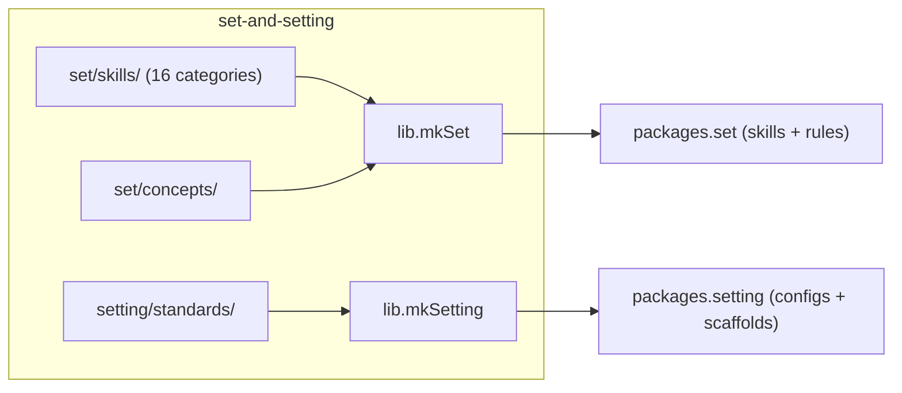
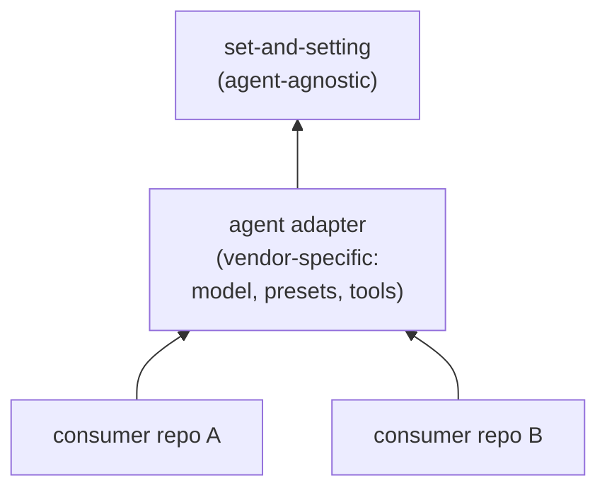
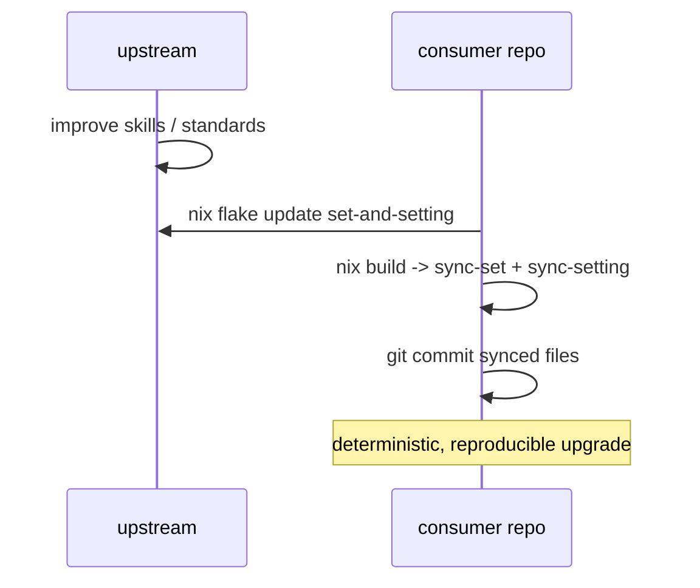

# set-and-setting

[](https://github.com/pr0d1r2/set-and-setting/actions/workflows/ci.yml)
[](https://nixos.org)

Deterministic, agent-agnostic **set** (mindset: skills, principles,
concepts) and **setting** (environment: guardrails, standards,
infrastructure) for AI coding agent trips.

Psychedelic metaphor: **set + setting = trip**.

## Get started -- one command, zero deps

```bash
nix run github:pr0d1r2/set-and-setting#mkSet
```

That is it. One command materializes curated AI coding skills into
`.claude/skills/set/` in your current directory. The only prerequisite
is nix with flakes enabled.

Core categories (`generic` + `git`) install by default. Add more:

```bash
nix run github:pr0d1r2/set-and-setting#mkSet -- nix security opensource
```

Install everything:

```bash
nix run github:pr0d1r2/set-and-setting#mkSet -- --all
```

Want unified configs (`.markdownlint.yml`, `.yamllint.yml`) and repo
scaffolds (`.editorconfig`, `.gitattributes`, `.gitignore`) too?
Bootstrap sets up skills and standards in one shot:

```bash
nix run github:pr0d1r2/set-and-setting#bootstrap
```

Run with `--help`, `--list`, or `--dry-run` on any installer to see
what it does before writing files.

Re-running `mkSet` with no arguments refreshes whatever was previously
installed (tracked in `.claude/skills/set/.mkset.json`). When upstream
changes, the installer detects the update and shows a notice.

## Three delivery paths

All three paths share one emitter -- the same skill sources produce
identical output regardless of how you consume them.

### Path 1 -- nix run (zero-dependency, per-CWD)

Run from any directory. Nix is the only dependency.

```bash
nix run github:pr0d1r2/set-and-setting#mkSet -- --all
nix run github:pr0d1r2/set-and-setting#mkSetting
nix run github:pr0d1r2/set-and-setting#mkSetting-init
```

| App | What it does |
| --- | ------------ |
| `mkSet` | Materialize skills into `.claude/skills/set/` |
| `mkSetting` | Materialize unified configs (always overwrites) |
| `mkSetting-init` | Scaffold repo starters (skips files that exist) |
| `bootstrap` | All three in one command |

Skills are emitted at run time -- the installer carries agnostic
source and emitter scripts, not a pre-built per-agent tree.

### Path 2 -- flake input (pinned, drift-checked)

Pin the version in your flake and sync after each update.

```nix
{
  inputs.set-and-setting.url = "github:pr0d1r2/set-and-setting";
}
```

```bash
nix flake lock --update-input set-and-setting
nix build .#agent-set && result/bin/sync-set .claude/skills/set
nix build .#agent-setting && result/bin/sync-setting
git add .claude/skills/set && git commit -m "chore: sync skills"
```

Use `lib.mkDriftCheck` in CI to catch uncommitted drift.

### Path 3 -- home-manager (user-level)

Install skills globally so every repo inherits them.

```nix
{
  home.file.".claude/skills/set".source =
    inputs.set-and-setting.packages.${system}.set;
}
```

This writes the full skill tree into `~/.claude/skills/set/`. No
per-repo sync needed -- Claude Code reads skills from both the repo
and the home directory.

## Architecture



## Consumer dependency graph



## Consumer workflow



## API

### `sets`

Attrset of raw paths to each of 16 skill category directories:

`generic` `architecture` `ci` `cli` `git` `gnu` `just` `language`
`lefthook` `nix` `nixos` `opensource` `product` `security` `test`
`update`

### `drafts`

Attrset of raw paths to draft category directories (opt-in via
`categories = [ "drafts/skill" ... ]`):

`skill` `agent` `nix` `ops` `context`

### `settings`

Attrset of raw paths to each standard directory:

`editorconfig` `gitattributes` `gitignore`

### `lib.mkSet`

Builds a skill-set derivation from selected categories. Emits the
Agent-Skills open-standard layout: one `SKILL.md` per category with
derived `name`/`description` frontmatter, plus raw facet files linked
from the body.

```nix
lib.mkSet {
  inherit pkgs;
  categories = [ "generic" "git" "nix" "security" ];
  concepts = true;   # include set/concepts/ (default: true)
  exclude = [ ];      # paths to exclude from output
}
```

Output layout:

- `.claude/skills/set/<category>/SKILL.md` -- domain skills
  (conditional-load `paths` field matching category globs)
- `.claude/skills/set/<category>/<facet>.md` -- raw facet files
- `.claude/rules/<category>.md` -- cross-cutting skills (always-on)
- `.claude/rules/concepts-<name>.md` -- concept files
- `bin/sync-set` -- copies emitted tree to a target directory

### `lib.mkSetting`

Builds infrastructure standards with two output kinds.

```nix
lib.mkSetting {
  inherit pkgs;
  editorconfig = true;
  gitattributes = true;
  gitignore = [ "nix" "claude" "setting" ];
  markdownlint = true;
  yamllint = true;
  fileSizeLimits = true;
}
```

**Materialized** (always synced, gitignored): `.markdownlint.yml`,
`.yamllint.yml`, `.claude/` commands and allowances.

**Seed/init** (scaffolded once, then repo-owned): `.editorconfig`,
`.gitattributes`, `.gitignore`,
`config/lefthook/file_size_limits.yml`, `.narrow-language-*.dic`,
`.nix-embedded-shell-allowlist`.

Two scripts: `bin/sync-setting` (materialize, always overwrites) and
`bin/sync-setting-init` (scaffold, skips files that exist).

### `lib.mkDriftCheck`

Compares synced project files against built derivation. Fails with
exit 1 on drift.

```nix
lib.mkDriftCheck {
  inherit pkgs skillSet;
  projectRoot = ./.;
  setPath = "agent/set";
}
```

### `checks`

`nix flake check` runs `mkSet-generic`, `compose-set`,
`mkSetting-default`, and `compose-setting` on all supported systems.

## Supported systems

- `aarch64-darwin`
- `x86_64-darwin`
- `x86_64-linux`
- `aarch64-linux`

## Agent-agnostic design

Skills in `set/` and standards in `setting/` contain no vendor-specific
content. The only agent-specific surface is a `{ dir, condField,
alwaysOnFile }` seam defaulting to Claude. The same agnostic sources
build for any agent given its seam values.

Any AI coding agent (Claude, Codex, Gemini CLI, Copilot, Amp, etc.)
can consume the output. See SPEC.md for the agnosticism proof targets.

## License

MIT
