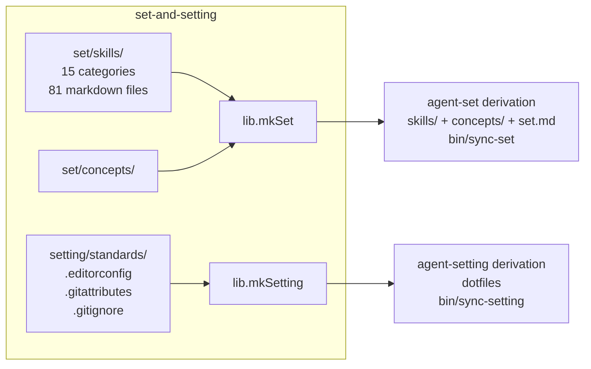
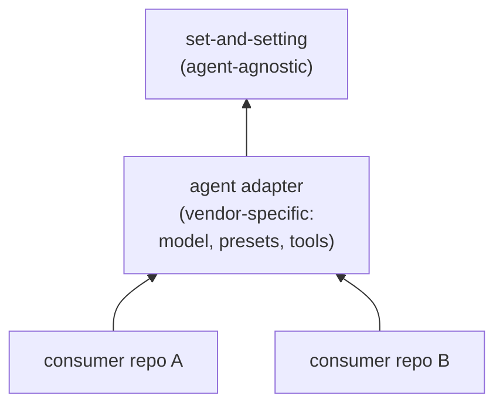

# set-and-setting

[](https://github.com/pr0d1r2/set-and-setting/actions/workflows/ci.yml)
[](https://nixos.org)

Deterministic, agent-agnostic **set** (mindset: skills, principles,
concepts) and **setting** (environment: guardrails, standards,
infrastructure) for AI coding agent trips.

Psychedelic metaphor: **set + setting = trip**.

Nix flake composes markdown skills and dotfile standards into immutable,
content-addressed derivations. Consumers import as a flake input, build
via nix closure, sync to repo -- skills update deterministically when
upstream improves.

## Architecture



## Consumer dependency graph



## Consumer workflow


## Quick start

Add as a flake input:

```nix
{
  inputs.set-and-setting.url = "github:pr0d1r2/set-and-setting";
}
```

Build a skill set and sync to your repo:

```bash
nix build .#set-and-setting.lib.mkSet
result/bin/sync-set agent/set
```

Build infrastructure standards and sync:

```bash
nix build .#set-and-setting.lib.mkSetting
result/bin/sync-setting
```

## API

### `sets`

Attrset of raw paths to each of 15 skill category directories:

`generic` `architecture` `ci` `git` `gnu` `just` `language` `lefthook`
`nix` `nixos` `opensource` `product` `security` `test` `update`

### `settings`

Attrset of raw paths to each standard directory:

`editorconfig` `gitattributes` `gitignore`

### `lib.mkSet`

Builds an `agent-set` derivation from selected categories.

```nix
lib.mkSet {
  inherit pkgs;
  categories = [ "generic" "git" "nix" "security" ];
  concepts = true;        # include set/concepts/ (default: true)
  exclude = [ ];           # paths to exclude from output
  extra = { };             # inline skill content (name -> markdown string)
  extraPaths = { };        # external skill files (name -> path)
}
```

Outputs: `$out/skills/<category>/<file>.md`, `$out/concepts/`,
`$out/set.md`, `$out/bin/sync-set`.

Category prefix is preserved in output paths to avoid collisions
between files with the same name in different categories.

### `lib.mkSetting`

Builds an `agent-setting` derivation from selected standards.

```nix
lib.mkSetting {
  inherit pkgs;
  editorconfig = true;     # include .editorconfig (default: true)
  gitattributes = true;    # include .gitattributes (default: true)
  gitignore = [ "nix" "claude" ];  # gitignore fragments to compose
  markdownlint = true;     # include .markdownlint.yml (default: true)
  yamllint = true;         # include .yamllint.yml (default: true)
  fileSizeLimits = true;   # include config/lefthook/file_size_limits.yml (default: true)
}
```

Outputs: `$out/.editorconfig`, `$out/.gitattributes`, `$out/.gitignore`,
`$out/.markdownlint.yml`, `$out/.yamllint.yml`,
`$out/config/lefthook/file_size_limits.yml`, `$out/bin/sync-setting`.

`sync-setting` copies only the files git must read as regular files
(`.editorconfig`, `.gitattributes`, `.gitignore`) into the repo root.
The lint configs are left in the derivation: out-link `agent-setting`
and point each tool at it (e.g.
`LEFTHOOK_MARKDOWNLINT_CONFIG=.setting/.markdownlint.yml`) so they need
no committed root file and never drift. See the `nix-lefthook-*`
remotes for the matching `LEFTHOOK_*_CONFIG` env vars.

### `lib.mkDriftCheck`

Compares synced project files against built derivation. Fails with
exit 1 on drift.

```nix
lib.mkDriftCheck {
  inherit pkgs skillSet;
  projectRoot = ./.;
  setPath = "agent/set";   # default
}
```

### `checks`

`nix flake check` builds `mkSet-generic` and `mkSetting-default`
on all supported systems.

## Supported systems

- `aarch64-darwin`
- `x86_64-darwin`
- `x86_64-linux`
- `aarch64-linux`

## Consumer upgrade

```bash
# Add input
nix flake lock --update-input set-and-setting

# Rebuild and sync
nix build .#agent-set && result/bin/sync-set
nix build .#agent-setting && result/bin/sync-setting

# Commit updated skills
git add agent/set .editorconfig .gitattributes .gitignore
git commit -m "chore: sync set-and-setting"
```

## Agent-agnostic design

Skills in `set/` and standards in `setting/` contain no vendor-specific
content. Any AI coding agent (Claude, GPT, Gemini, Copilot, etc.) can
consume the output. Agent-specific adapters (model selection, tool
configuration, presets) belong in downstream packages.

## License

MIT
